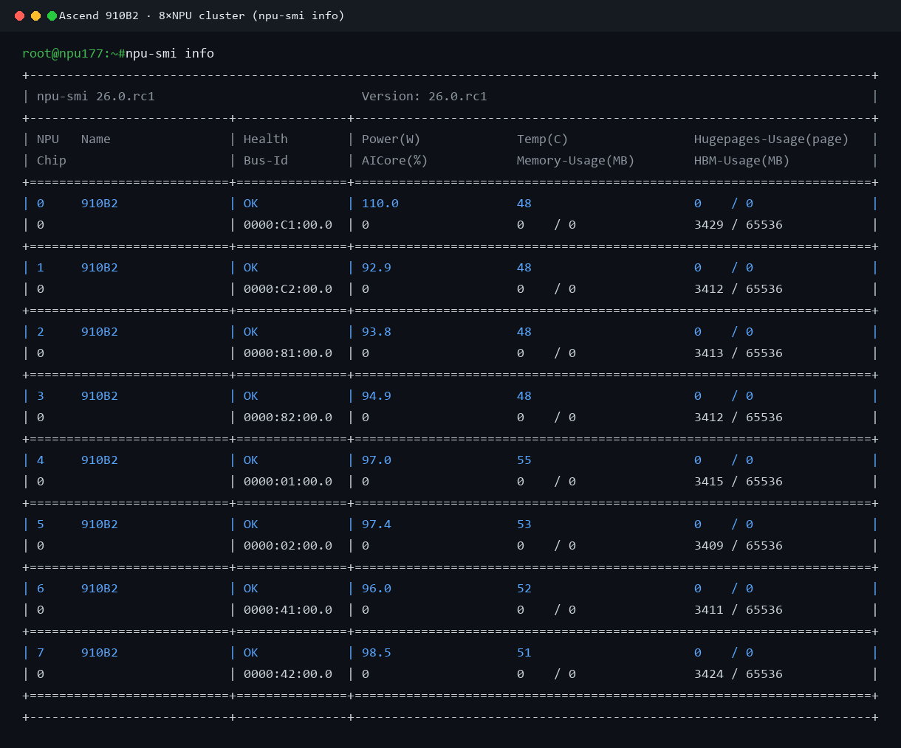
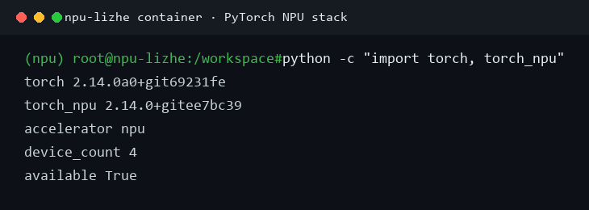
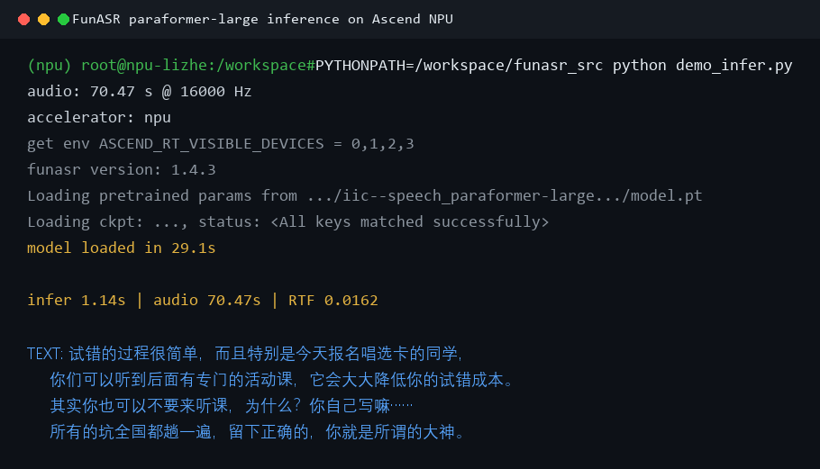
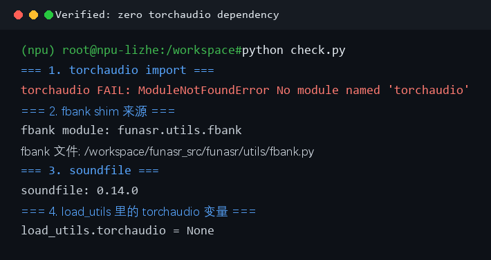

# FunASR 在昇腾 910B 上"零 torchaudio 依赖"跑通：踩坑、解法与上游 PR

> 一篇讲清楚：为什么阿里的 FunASR 在国产昇腾 NPU 上默认起不来，以及怎么用最小改动让它跑起来，并且把这个改动提回了上游。

---

## TL;DR

- FunASR 官方**硬依赖 torchaudio**，而昇腾交付环境是 **aarch64（鲲鹏 ARM）+ openEuler**，华为 fork 的 PyTorch 版本号 `2.14.0a0` 与官方脱钩，**仓库里根本没有匹配的 torchaudio wheel**。
- 解法：把 FunASR 里对 torchaudio 的依赖全部改成**可选**，特征提取用独立的 `kaldi-native-fbank` 兜底，音频加载用 `soundfile` 兜底。
- 结果：**不装 torchaudio，FunASR 在 910B 上完整跑通**，paraformer-large 识别 70.47 秒音频仅用 1.14 秒，**RTF ≈ 0.016（约 62 倍实时）**。
- 改动已合并为一个 PR 提交上游（原 #3527 已并入 #3526，使改动原子化）；已收到维护者 LauraGPT 的 CHANGES_REQUESTED review 并逐条修复，欢迎继续 review：
  - **PR #3526**：Remove hard torchaudio dependency for inference; add kaldi-native-fbank fbank backend
    https://github.com/modelscope/FunASR/pull/3526

---

## 一、问题背景：FunASR 为什么在昇腾上起不来

FunASR 是阿里达摩院开源的语音识别工具包，推理链路里默认走 torchaudio：

1. **声学特征（fbank）**：`funasr.frontends.wav_frontend`、`speaker_utils`、`campplus` 都 `import torchaudio.compliance.kaldi`
2. **音频加载**：`load_utils.load_audio_text_image_video` 优先用 torchaudio 读音频
3. **重采样 / 训练对齐**：`load_utils.Resample`、paraformer_v2 的 `forced_align` 也依赖 torchaudio

而昇腾 NPU 交付环境（910B 系列）的通病是：**aarch64 架构 + 华为 fork 的 PyTorch**。

- 机器是鲲鹏 ARM（aarch64），不是 x86；
- torch 是华为 nightly fork，版本号 `2.14.0a0+git69231fe`，**和 PyTorch 官方版本号完全脱钩**；
- torchaudio 的 wheel 是按官方 torch 版本号配对的，`2.14.0a0` 这个版本号在 PyPI 上**不存在任何匹配的 aarch64 wheel**。

于是只要 `import funasr`，第一步就死在 `ModuleNotFoundError: No module named 'torchaudio'`。装 torchaudio 又装不上（版本号对不上），是个死结。

---

## 二、解法：把 torchaudio 的硬依赖变成"可选 + 兜底"

核心思路一句话：**torchaudio 能装上就用它，装不上就走等价替代**，保证 FunASR 在**任何没有 torchaudio 的环境**都能跑。

### 1. fbank 特征提取 → kaldi-native-fbank 兜底

新增一个薄 shim 文件 `funasr/utils/fbank.py`，对外提供和 `torchaudio.compliance.kaldi.fbank` 完全一致的签名：

```python
try:
    import torchaudio.compliance.kaldi as _torchaudio_kaldi
    _HAS_TORCHAUDIO = True
except Exception:
    _HAS_TORCHAUDIO = False
    import kaldi_native_fbank as _knf

def fbank(waveform, **kwargs):
    if _HAS_TORCHAUDIO:
        return _torchaudio_kaldi.fbank(waveform, **kwargs)   # x86 用户零影响
    return _fbank_knf(waveform, **kwargs)                    # aarch64 走 KNF
```

`kaldi-native-fbank` 是独立 C++ 实现的 Kaldi fbank，**没有 torch 依赖**，官方直接提供 manylinux aarch64 wheel。它只做 CPU 上的特征提取（fbank 本来就在 CPU 上算），和 torchaudio 的结果一致。

关键设计：**保留 torchaudio 优先路径**。x86 上本来就装着 torchaudio 的用户完全不受影响，只有装不上 torchaudio 的环境才切到 KNF。这正是社区愿意接受的最小侵入式改法。

### 2. 音频加载 / 重采样 → soundfile 兜底 + try/except

`load_utils.py` 里把 torchaudio 的导入改成可选，加载音频失败时回退到 `soundfile`（libsndfile 的 Python 绑定，aarch64 也有 wheel）。

### 3. 次要模型的 torchaudio 全部 try/except 化

paraformer_v2_community、fun_asr_nano、数据集预处理器这几处的顶层 `import torchaudio` 统一改成 try/except，失败时置 `None`，让这些模块在**不 import torchaudio 的前提下也能被 import 模块树扫描到**（即使它们的功能需要 torchaudio，也不会拖垮核心推理）。

---

## 三、环境一览

目标机器：昇腾 910B2，8 卡（本次容器分配到 4 卡）。



容器内 PyTorch NPU 栈：



注意版本号 `torch 2.14.0a0`——这就是 torchaudio 装不上的根因。

---

## 四、一键跑通（复现命令）

在昇腾 NPU 环境（已 `source` CANN 环境 + 激活 `npu` conda 环境）里：

```bash
# 1. 装两个轻量依赖（都不依赖 torch）
pip install kaldi-native-fbank soundfile

# 2. 拿改动后的 FunASR（PR 合入前用 fork 分支，合入后 pip install funasr 即可）
git clone https://github.com/li-lizhe/FunASR.git
cd FunASR && git checkout asc-npu-fbank-fallback   # PR1 核心分支

# 3. 直接跑推理（paraformer-large，模型会自动从 ModelScope 下载）
python - <<'PY'
import time, urllib.request, soundfile as sf
from funasr import AutoModel

url = "https://isv-data.oss-cn-hangzhou.aliyuncs.com/ics/MaaS/ASR/test_audio/vad_example.wav"
urllib.request.urlretrieve(url, "/tmp/vad_example.wav")
audio, sr = sf.read("/tmp/vad_example.wav")
dur = len(audio) / sr
print("audio: %.2f s @ %d Hz" % (dur, sr))

model = AutoModel(
    model="iic/speech_paraformer-large_asr_nat-zh-cn-16k-common-vocab8404-pytorch",
    device="npu:0", hub="ms",
)
t0 = time.time()
res = model.generate(input="/tmp/vad_example.wav")
dt = time.time() - t0
print("infer %.2fs | audio %.2fs | RTF %.4f" % (dt, dur, dt / dur))
print("TEXT:", res[0]["text"])
PY
```

实际运行输出：



**70.47 秒的音频，1.14 秒出识别结果，RTF ≈ 0.0162**，实时率约 62 倍。

---

## 五、验证：真的没有 torchaudio

用一段检查脚本确认 torchaudio 确实不在、且 FunASR 依然完整可用：



四个关键点：

1. `import torchaudio` → **ModuleNotFoundError**（这台机器就是没有 torchaudio）
2. fbank shim 真实生效，模块来源是 `funasr.utils.fbank`
3. `soundfile 0.14.0` 可用（音频加载兜底）
4. `load_utils.torchaudio = None`（我们的 try/except 可选化生效，不崩溃）

> 说明：有些环境跑 FunASR 会看到一行 `Notice: ffmpeg is not installed. torchaudio is used to load audio`，这是 FunASR 的**固定提示文本**，不代表真的用了 torchaudio。有没有真用，看上面第 4 点 `load_utils.torchaudio` 是不是 `None` 一眼便知。

---

## 六、PR 演进：从拆分到合并 + 应对 review

最初按"小量多次分批提交更利于社区 review"的思路，把 9 个文件拆成两个独立 PR（#3526 核心 + #3527 扩展）。但维护者 LauraGPT review 后指出：**#3527 功能上依赖 #3526，单独看是 broken 的**，建议 combine 或 rebase。于是把 #3527 并入 #3526，使改动原子化。

维护者还提出了几处改进，均已修复：

| 反馈 | 修复 |
| --- | --- |
| kaldi-native-fbank 未声明依赖，干净环境 import 仍崩 | 加 optional `knf` extra，`fbank()` 调用时无后端才报可操作 ImportError |
| fbank shim 的 `**kwargs` 静默吞参（如 `channel`） | 显式处理 `channel`；`subtract_mean`/`min_duration`/VTLN/`blackman_coeff` 显式 NotImplementedError |
| `forced_align` 把"缺 torchaudio"吞成空结果 | 新增统一 `torchaudio_compat` guard，依赖缺失时传播 ImportError |
| 没测"torchaudio 完全缺席"环境 | 新增 `tests/test_torchaudio_optional.py` 回归测试（10/10 通过） |

修复后重新验证：RTF ≈ 0.0164，识别正确，零 torchaudio 依赖成立。

欢迎各位顺手 review / 点 star，也欢迎在昇腾、寒武纪、摩尔线程等其它 aarch64 国产卡上帮忙验证。

---

## 附：关键文件

```
funasr/utils/fbank.py                  # 新增：kaldi-native-fbank 兜底 shim（含 channel 处理 + 显式 reject）
funasr/utils/torchaudio_compat.py      # 新增：统一 torchaudio 依赖 guard
funasr/frontends/wav_frontend.py       # fbank import 切换
funasr/utils/speaker_utils.py          # fbank import 切换
funasr/models/campplus/utils.py        # fbank import 切换
funasr/utils/load_utils.py             # torchaudio 可选 + soundfile/librosa 兜底
funasr/models/paraformer_v2_community/model.py   # torchaudio try/except + force_align guard
funasr/models/fun_asr_nano/tools/utils.py        # torchaudio 可选 + forced_align guard
funasr/datasets/audio_datasets/preprocessor.py   # torchaudio 可选 + speed_perturb guard
funasr/datasets/llm_datasets/preprocessor.py     # torchaudio try/except
tests/test_torchaudio_optional.py      # 新增：无 torchaudio 回归测试
setup.py                               # 新增 optional knf extra
```